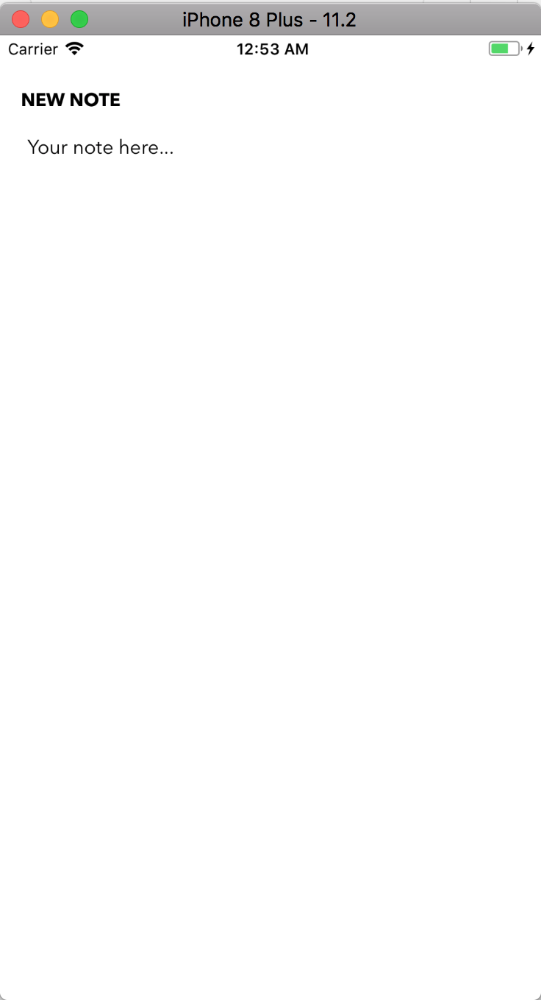
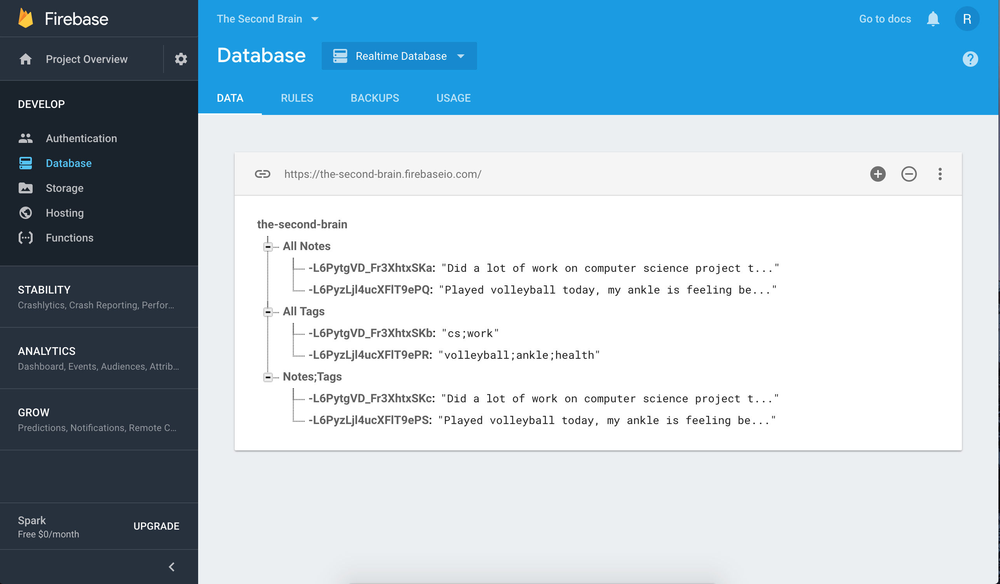
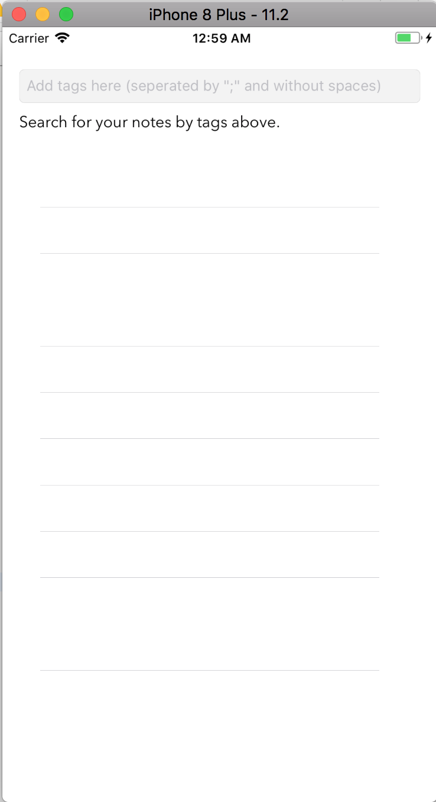

# Second-Brain
A note taking iOS application formatted in a diary/calendar style.

The application sorts entries by date, tags, and topics in a database using Google's Firebase.

### Required Software

- <a href = "https://developer.apple.com/xcode/">xCode 9 </a>
- <a href = "https://guides.cocoapods.org/using/getting-started.html">CocoaPods (manages iOS App Dependencies; needed for Firebase and JTAppleCalender)</a>
- <a href = "https://firebase.google.com/">Firebase </a>

## Install dependencies
To install CocoaPods: `sudo gem install cocoapods`
To install Firebase: `npm install -g firebase-tools`

## Screenshots

<!-- .element height="10%" width="10%" -->

